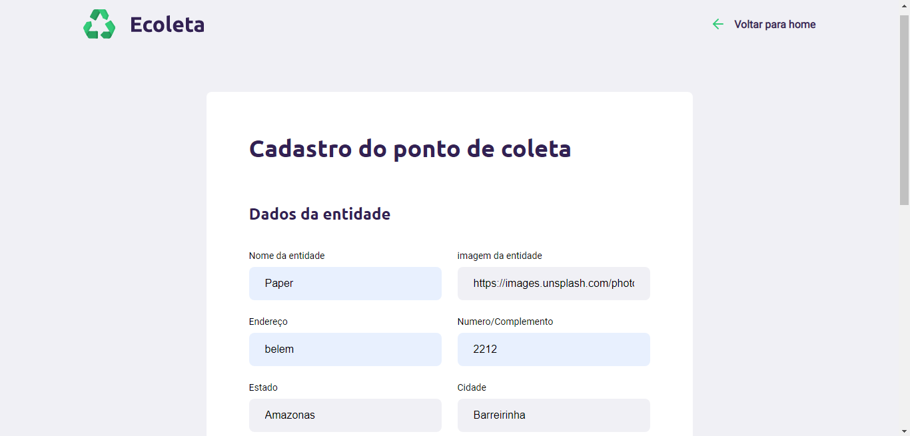
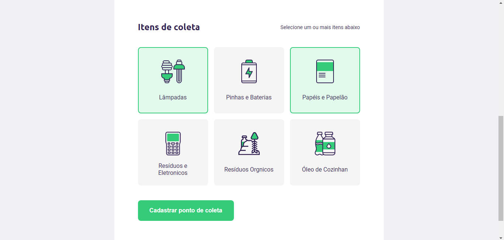
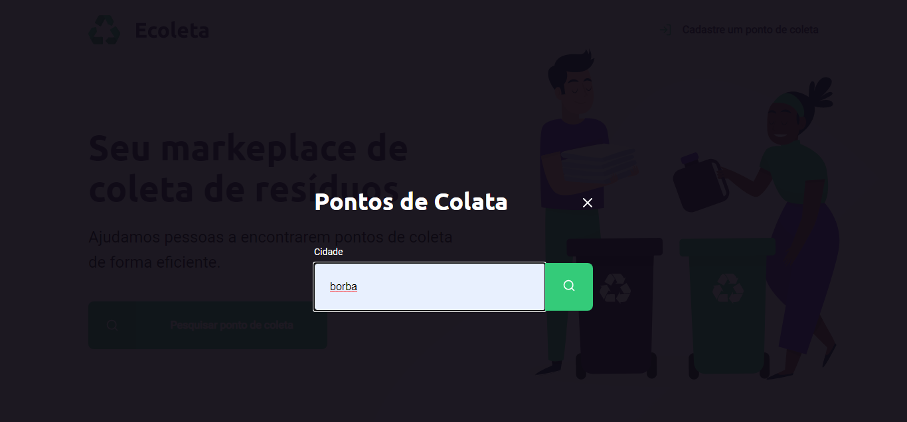
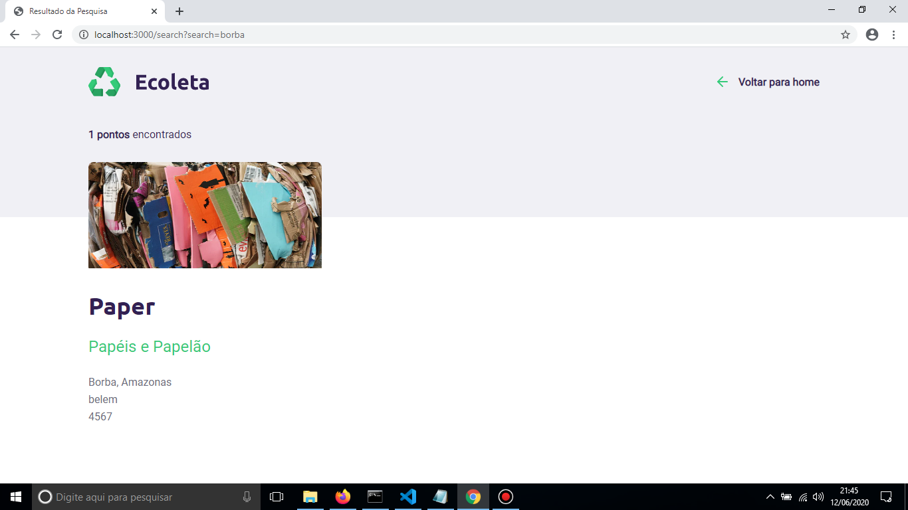

<h3>Projeto desenvolvido com as tecnologias<h3>

 
 Node.js, Express, SQLite, Nunjucks, html, javascript

Ecoleta é um sistema web que ajuda pessoas a encontrarem pontos de coleta de resíduos. Projeto desenvolvido no 1° Next Level Week
da Rocketseat.

<h2>Telas</h2> 

